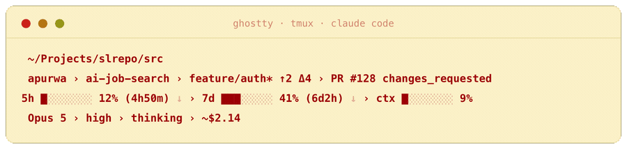
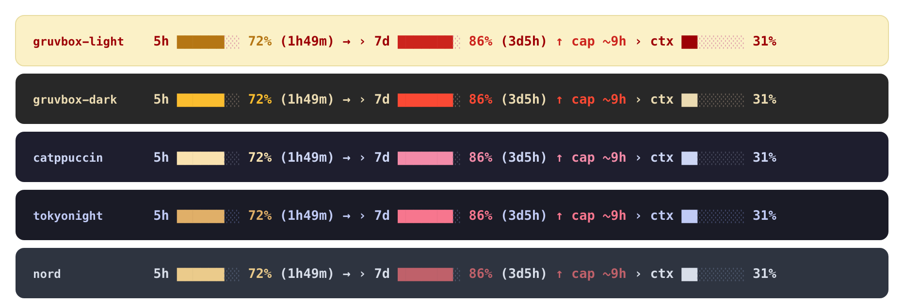

# Ghostty + tmux + Claude Code setup

<p align="center">
  
</p>

A four-line [Claude Code](https://claude.com/claude-code) **status line**: your
5-hour, 7-day and context-window usage as live bars, each with a reset countdown
and a **burn-rate pace** (`↓` under pace, `→` on pace, `↑ cap ~Xh` when you're on
track to hit the limit before it resets), your **open-PR count**, and
**alarm-only heat** so the line stays calm maroon and only turns amber, then red,
as a metric runs hot. Bundled with the [Ghostty](https://ghostty.org) +
[tmux](https://github.com/tmux/tmux) setup it was built for: Shift+Enter for a
newline inside Claude Code, and a right-click pane menu that works even in it.

Gruvbox Light theme, everything in maroon (`#9d0006`).

One command on a fresh machine:

```bash
git clone https://github.com/apurwa/ghostty-tmux-claude-setup.git
cd ghostty-tmux-claude-setup
./install.sh          # copy configs   (or: ./install.sh --link to symlink)
```

Then reload Ghostty (`Cmd+Shift+,`) and open a fresh tmux window. That's it.

Want just the status line, without the Ghostty and tmux configs?

```bash
./install.sh --statusline-only                 # status line + settings only
./install.sh --statusline-only --theme nord    # ...in a different theme
```

The installer is idempotent and backs up anything it replaces to
`<file>.bak-<timestamp>`, so it is safe to re-run and easy to undo.

---

## What you get

**Status line** — four lines in bold maroon, with amber/red heat that shows only
when a metric runs hot:

```
 ~/Projects/slrepo/src › ◇ fix-auth
 apurwa › ai-job-search › feature/auth* ↑2 Δ4 › PR #128 changes_requested
 5h ███░░░░░ 43% (1h49m) ↓ › 7d ███████░ 86% (3d5h) ↑ cap ~4h › ctx ██░░░░░░ 31%
 Opus 5 › high › thinking › ~$35.11
```

(A pull-request icon and count sit after the repo name when you have open PRs; the
`↓ → ↑` after a limit is the burn-rate pace, with `cap ~Xh` — the ETA to 100% —
shown when over pace. Leading per-line icons are omitted here as they need a
Nerd Font to render.)

|  | Line | Shows |
|---|---|---|
|  | project | full working-directory path (~ for home) › `◇` worktree |
|  | repo | `username` › `repo` (+ pull-request icon & your open-PR count) › branch (`*` dirty, `↑n↓n` vs upstream, `Δn` vs default) › PR # + review state |
|  | usage | 5-hour limit, 7-day limit, and context window (`ctx`), each a progress bar with its percent, reset countdown, and burn-rate pace (`↓`/`→`/`↑ cap ~Xh`). Amber at ≥60%, red at ≥80% |
|  | session | model › effort › thinking › estimated session cost |

**Themes** — the status line ships in five palettes. `gruvbox-light` is the
default; the rest keep the same alarm-only heat ramp (calm → amber → red) tuned
to each palette.

<p align="center">
  
</p>

Pick one with the `STATUSLINE_THEME` environment variable. Either let the
installer set it:

```bash
./install.sh --theme catppuccin
```

or set it yourself in `~/.claude/settings.json`:

```json
{ "statusLine": { "type": "command",
    "command": "STATUSLINE_THEME=tokyonight bash ~/.claude/statusline-command.sh" } }
```

Themes: `gruvbox-light`, `gruvbox-dark`, `catppuccin`, `tokyonight`, `nord`. Add
your own by dropping a four-colour case into the palette block near the top of
`statusline-command.sh` — a calm primary, the warn and alarm heat tones, and the
empty-bar track.

**Ghostty**
- **Shift+Enter inserts a newline** in Claude Code (and other TUIs) instead of
  submitting — sends `ESC`+`Enter`, which passes cleanly through tmux.
- **Gruvbox Light** theme (background `#fbf1c7`).

**Claude Code**
- Theme set to `light` so its own UI text stays legible on the cream
  background (the default dark theme's dimmed text is light-grey and washes out).

**tmux**
- **Right-click any pane → Split / New Window / Zoom / Kill menu**, even inside
  a mouse-capturing app like Claude Code (see the note under *Design decisions*).
- `Ctrl-B |` split right, `Ctrl-B -` split down — both open in the current
  directory. `Ctrl-B c` new window, same directory.
- `Alt`+arrow to move between panes with no prefix. Mouse on: click to focus,
  drag borders to resize, wheel to scroll.
- Windows numbered from 1 and renumbered on close; centred window list; maroon
  status bar to match. `Ctrl-B r` reloads the config.

---

## Layout

```
ghostty/config                  → ~/.config/ghostty/config
tmux/tmux.conf                  → ~/.tmux.conf
claude/statusline-command.sh    → ~/.claude/statusline-command.sh
claude/glyph-test.sh            → ~/.claude/glyph-test.sh   (icon/width tester)
claude/settings.snippet.json    → merged into ~/.claude/settings.json
```

The installer never overwrites `settings.json` — it merges only the `theme` and `statusLine`
keys with `jq`, so your existing permissions, model, and other settings survive.

---

## Requirements

- **macOS** with [Homebrew](https://brew.sh) (the installer uses it for deps).
- **Ghostty**, **tmux 3.3+** (3.7+ recommended), and **Claude Code**.
- `jq` and a **Symbols-only Nerd Font** — the installer adds both:
  `brew install jq` and `brew install --cask font-symbols-only-nerd-font`.

The status line reads Claude Code's own usage data — no API key needed. The only
network touch is the optional open-PR count, which shells out to `gh` (cached,
refreshed in the background, and silently skipped if `gh` is missing or offline).
Session cost is estimated from the transcript — see below.

---

## Design decisions

A few choices that aren't obvious, recorded so future-you doesn't re-derive them:

- **Right-click needed an override, and it's a tmux default — not a Ghostty
  limit.** tmux's stock binding only shows the pane menu when no foreground app
  has mouse capture on; inside Claude Code / vim / less it forwards the click to
  the app instead. `tmux.conf` rebinds `MouseDown3Pane` unconditionally so the
  menu always opens. Trade-off: apps no longer receive a right-click (rarely
  used in a terminal).

- **Shift+Enter needs tmux `extended-keys on`**, not just the Ghostty keybind.
  Without it tmux flattens the modified key back to a plain Enter before the app
  sees it. Both halves are in this repo.

- **Status icons are Nerd Font glyphs, not emoji.** Emoji ignore ANSI colour
  (they'd render multicolour, not maroon) and are double-width. The Nerd Font
  glyphs are monochrome, single-width, and inherit the maroon. They're written
  as octal escapes in the script because private-use-area characters get
  stripped when pasted through many editors and tools.

- **"Daily / monthly" limits don't exist.** Claude Code's status line payload
  only exposes rolling **5-hour** and **7-day** windows, so that's what's shown.

- **Session cost is an estimate.** Cost isn't in the status line payload; the
  script sums per-response token usage from the transcript and prices it with a
  rate table (Opus/Sonnet/Haiku/Fable, cache tiers priced separately). Update
  the `RATES` in `session_cost()` if prices change. A resumed session only counts
  what its current transcript holds. Shown with a `~` for that reason.

- **Each theme is only four colours.** The whole line is one calm colour; heat is
  the only thing that ever changes it, and only above 60%. So a palette is just a
  calm primary, a warn tone, an alarm tone, and the empty-bar track — which is why
  a new theme is a one-line `case` near the top of `statusline-command.sh`. Light
  themes carry a coloured primary (the signature look); dark themes use the
  theme's foreground as the calm colour, which reads better on a dark background.

Run `~/.claude/glyph-test.sh` if you swap in a new icon; it prints candidate
glyphs between alignment pipes so you can spot any that render double-width.

---

## Uninstall

Every file the installer touched has a `.bak-<timestamp>` beside it. Restore the
most recent, or just delete the four installed files and remove the `statusLine`
block from `~/.claude/settings.json`.

---

## License

[MIT](LICENSE) — use it, fork it, retune the palette.
